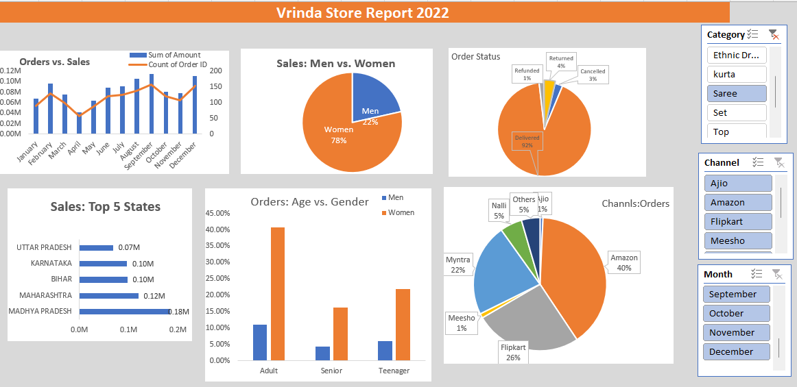

# Vrinda-Store-Data-Analysis

This project provides a comprehensive sales analysis for **Vrinda General Store**, including data cleaning, visualization, and actionable business insights. The goal is to guide customer targeting strategies for increased future sales.

## Features

- Cleaned raw sales and customer data using Excel tools.
- Created pivot tables and visual charts to track:
  - Regional and demographic trends
  - Product and channel-wise performance
- Built an interactive Excel dashboard to support decision-making.

## Tools Used

- **Microsoft Excel**
  - Power Query (for cleaning)
  - Pivot Tables (for aggregation)
  - Charts, Slicers & Conditional Formatting (for dashboard)

## Dashboard Screenshot

## Insights

- Women buy more compared to men (**78%**).
- **Maharashtra, Karnataka, and Uttar Pradesh** are the top 3 contributing states.
- Adult age group (**30–49 years**) contributes the most (**~45%**).
- **Amazon(**~40%**), Flipkart(**~26%**), and Myntra(**~22%**)** are the top-performing sales channels.

## Final Recommendation

**Target women** aged **30–49 years** from **Maharashtra, Karnataka, and Uttar Pradesh**  
Promote via ads, offers, or coupons on **Amazon, Flipkart, and Myntra** to boost sales.

## How to Run

1. Download the Excel file `Vrinda Store Data Analysis.xlsx`.
2. Open the file in Excel (2016 or later).
3. Navigate to the **Vrinda Store Report 2022** sheet and interact with slicers/filters to explore insights.

